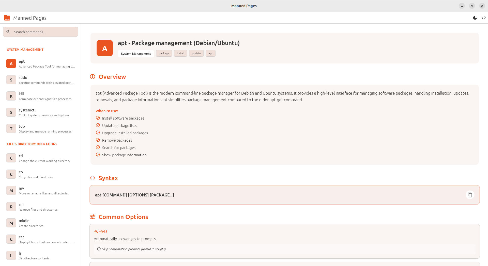
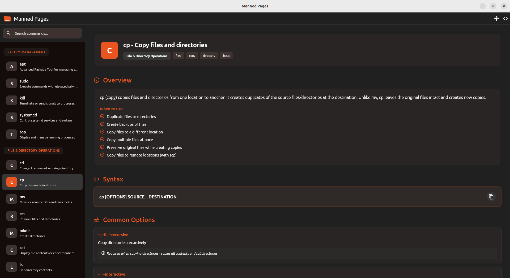
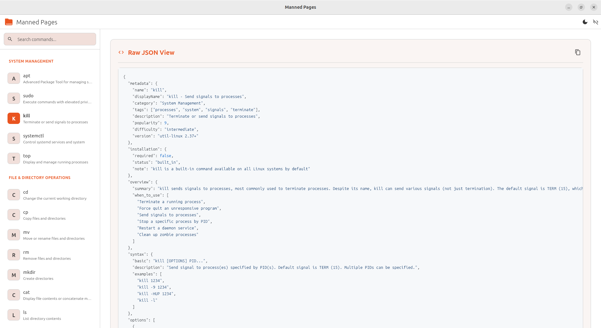

# Manned Pages

**A modern, user-friendly Linux command reference application for Ubuntu**

Manned Pages is an intuitive desktop application that provides comprehensive documentation for the most commonly used Linux commands. Designed specifically for Ubuntu with the native Yaru theme, it presents command information in a clean, accessible interface that's easier to navigate than traditional man pages.

## ✨ Features

### 🎯 Core Functionality
- **Comprehensive Command Database**: Access detailed documentation for top Linux commands
- **Two-Pane Interface**: Browse commands on the left, view detailed documentation on the right
- **Smart Search**: Real-time search across command names, descriptions, options, and examples
- **Category Organization**: Commands organized by category (File Operations, System Information, etc.)

### 📚 Rich Documentation
- **Installation Instructions**: Clear steps for commands that require installation (like `htop`)
- **Command Overview**: Quick summaries with use-case scenarios
- **Syntax & Options**: Detailed syntax with organized option descriptions and use cases
- **Real-World Examples**: Practical examples with:
  - Expected command output
  - Field-by-field output explanations
  - Format breakdowns for complex outputs
  - Copy-to-clipboard functionality

### 🎨 User Experience
- **Yaru Theme Integration**: Native Ubuntu look and feel with light/dark mode support
- **Theme Toggle**: Quick switch between light and dark modes via AppBar button
- **Auto-Scroll**: Automatically scrolls to top when selecting different commands
- **Visual Indicators**: Installation requirements, categories, and tags clearly displayed
- **Smooth Animations**: Polished interface with smooth transitions

### 📖 Advanced Features
- **Common Misconceptions**: Learn what beginners often get wrong
- **Pitfalls & Solutions**: Avoid common mistakes with practical solutions
- **Best Practices**: Expert tips for using commands effectively
- **Performance Tips**: Optimization advice for better command usage
- **Related Commands**: Discover similar or complementary commands
- **Raw JSON View**: Toggle between formatted UI and raw JSON with:
  - Syntax highlighting for better readability
  - Monospace font (Ubuntu Mono) for accurate display
  - Theme-aware color schemes (light/dark)
  - Copy-to-clipboard functionality
  - Direct access to original JSON file content

## 📸 Screenshots

### Light Mode


### Dark Mode


### JSON View


## 🚀 Getting Started

### Prerequisites
- Ubuntu Linux (latest LTS or recent release)
- Flutter SDK (latest stable version)
- Linux desktop environment

### Installation

1. **Clone the repository**
   ```bash
   git clone <repository-url>
   cd manned_pages
   ```

2. **Install dependencies**
   ```bash
   flutter pub get
   ```

3. **Run the application**
   ```bash
   flutter run -d linux
   ```

   Or build a release version:
   ```bash
   flutter build linux
   ```

## 📱 Usage

### Navigating Commands
1. **Browse**: Scroll through the command list on the left pane
2. **Search**: Use the search bar at the top to filter commands by name or description
3. **Select**: Click on any command to view its detailed documentation
4. **Copy**: Click the copy button next to commands/examples to copy them to clipboard

### Viewing Documentation
Each command includes:
- **Header**: Command name, category, tags, and installation status
- **Installation**: Step-by-step instructions if required
- **Overview**: Summary and when to use the command
- **Syntax**: Command syntax with examples
- **Options**: Common flags with descriptions and use cases
- **Examples**: Practical usage examples with output explanations
- **Misconceptions**: Common misunderstandings clarified
- **Pitfalls**: Common mistakes and how to avoid them
- **Best Practices**: Professional tips for effective usage
- **Performance Tips**: Optimization advice
- **Related Commands**: Discover similar tools

### Theme & View Options
- **Theme Toggle**: Click the sun/moon icon in the AppBar to switch between light and dark modes
- **JSON View**: Click the code icon to toggle between formatted UI and raw JSON view
  - JSON view shows the original file content with syntax highlighting
  - Useful for developers and contributors
  - Copy button available to copy entire JSON


## 🛠️ Technical Details

- **Framework**: Flutter (cross-platform Linux development)
- **Theme**: Yaru (Ubuntu's native theme)
- **Architecture**: Offline-first with local JSON data storage
- **Data Format**: Structured JSON files for easy maintenance and expansion

## 🎯 Purpose

Manned Pages was created to address the common challenges users face with traditional man pages:
- **Accessibility**: Easier to read and navigate than terminal-based man pages
- **Visual Clarity**: Clean, modern interface with proper formatting
- **Learning-Friendly**: Includes examples, misconceptions, and best practices
- **Quick Reference**: Fast search and filtering for immediate answers

Whether you're a Linux beginner learning the basics or an experienced user looking for quick command references, Manned Pages makes Linux command documentation accessible and enjoyable.

## 📝 Data Structure

Command documentation is stored in JSON format in the `assets/data/` directory. Each command file includes:
- Metadata (name, category, tags, popularity)
- Installation requirements
- Overview and use cases
- Syntax and options
- Examples with detailed output explanations
- Misconceptions and pitfalls
- Best practices and performance tips
- Related commands

## 🔮 Future Features

We're planning to add several exciting features to enhance the application:

### 📖 Enhanced Documentation
- **Open Man Page**: Direct integration to open the system's man page for any command
  - Quick access to official documentation
  - Fallback to online man pages if local man page unavailable
  - Option to view man page in terminal or external viewer

### 📝 User Notes & Annotations
- **Personal Notes**: Add custom notes and annotations to commands
  - Save personal tips and reminders
  - Tag commands with custom categories
  - Search through user notes
  - Export/import notes for backup

### 🔍 Advanced Search & Discovery
- **Fuzzy Search**: Improved search with typo tolerance
- **Search History**: Remember recent searches
- **Command Favorites**: Mark frequently used commands
- **Recent Commands**: Quick access to recently viewed commands

### 🔗 Integration & Export
- **Terminal Integration**: Quick copy-to-terminal functionality
- **Export Documentation**: Export command docs as PDF, Markdown, or HTML
- **Share Commands**: Share command examples via URL or file
- **Bookmark System**: Save specific examples or sections for later

### 🌐 Community Features
- **User Contributions**: Community-submitted examples and tips
- **Rating System**: Rate command documentation quality
- **Comments & Discussions**: Community discussions on command usage
- **Translation Support**: Multi-language documentation

### ⚙️ Customization
- **Custom Themes**: Additional theme options beyond light/dark
- **Layout Options**: Adjustable pane sizes and layouts
- **Font Customization**: Adjustable font sizes and families
  - **JSON View Font Size**: Adjustable font size setting specifically for JSON view
  - Per-section font size preferences
- **Keyboard Shortcuts**: Customizable keyboard shortcuts

### 🔄 Sync & Backup
- **Cloud Sync**: Sync user notes and preferences across devices
- **Backup/Restore**: Export and import user data
- **Offline Mode**: Enhanced offline functionality

### 📱 Platform Expansion
- **CLI Tool**: Command-line interface for power users

## 🤝 Contributing

Contributions are welcome for the features above.

## 📄 License

This project is licensed under the **WTFPL (Do What The Fuck You Want To Public License)** - see the LICENSE file for details.

**Manned Pages is completely open source** - you are free to use, modify, and distribute this software however you want. No restrictions, no obligations. Just do what you want with it.

For more information about WTFPL, visit: https://www.wtfpl.net/

---

**Made with ❤️ for the Linux community by Patrick Karuri (https://github.com/pkariithi) using Cursor AI (https://cursor.com/home)**

*Manned Pages - Making Linux commands accessible to everyone*
